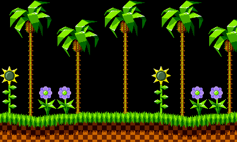

# Tilengine - The 2D retro graphics engine
[](https://opensource.org/licenses/MPL-2.0)
[](https://travis-ci.org/megamarc/Tilengine)
[](https://ci.appveyor.com/project/megamarc/tilengine)
[](https://scan.coverity.com/projects/megamarc-tilengine)

Tilengine is an open source, cross-platform 2D graphics engine for creating classic/retro games with tile maps, sprites and palettes. Its unique scanline-based rendering algorithm makes raster effects a core feature, a technique used by many games running on real 2D graphics chips.

http://www.tilengine.org

# Contents
- [Features](#features)
- [Getting binaries](#getting-binaries)
- [Installing](#installing)
    - [Windows](#windows)
    - [Unix-like](#unix-like)
- [Running the samples](#running-the-samples)
    - [Windows](#windows-1)
    - [Unix-like](#unix-like-1)
- [The tilengine window](#the-tilengine-window)
- [Creating your first program](#creating-your-first-program)
    - [Windows](#windows)
    - [Linux](#linux)
    - [Apple OS X](#apple-os-x)
- [Documentation](#documentation)
- [Editing assets](#editing-assets)
- [Creating packages](#creating-packages)
- [Bindings](#bindings)
- [Contributors](#contributors)

# Features
* Written in portable C (C99)
* MPL 2.0 license: free for any project, including commercial ones, allows console development
* Cross platform: available builds for Windows (32/64), Linux PC(32/64), Mac OS X and Raspberry Pi
* High performance: all samples run at 60 fps with CRT emulation enabled on a Raspberry Pi 3
* Streamlined, easy to learn API that requires very little lines of code
* Built-in SDL-based windowing for quick tests
* Integrate inside any existing framework as a slave renderer
* Loads assets from open standard standard file formats
* Create or modify graphic assets procedurally at run time
* True raster effects: modify render parameters between scanlines
* Background layer scaling and rotation
* Sprite scaling
* Several blending modes for layers and sprites
* Pixel accurate sprite vs sprite and sprite vs layer collision detection
* Special effects: per-column offset, mosaic, per-pixel displacement, CRT emulation...
* Supports packaged assets with optional AES-128 encryption

# Getting binaries

## Download from itch.io
The best way to get prebuilt binaries ready to run is grabbing them from official itch.io acount: https://megamarc.itch.io/tilengine. Just download the package for your platform. You can also find prebuilt binaries and their dependencies inside the `/lib` directory

## Build from source
You can also build the library from source. It's very easy:
### Windows
Open the `/Tilengine.sln` project, you'll need Visual Studio Community. x86 and x64 targets provided.
### Linux/OSX
**Prerequisites**: you'll need GNU Make and GCC toolchain, and development libraries for png and SDL2. To install required packages, open a terminal window and run the following command:
```
> sudo apt-get install build-essential libpng-dev libsdl2-dev
```
To build the library itself, open a terminal window in `/src` and run the following command:
```
> make
```
After build, `libTilengine.so` file will be placed in `/Tilengine/lib` folder.

# Installing
After building from source, open a console window in Tilengine root directory and type the suitable command depending on your platform:

## Windows
```
> install
```

## Debian-based linux
```
> sudo ./install
```

**Note for OS X users**: Tilengine depends on having SDL2 in Framework format installed on your system, that by default is not installed. Please download it here: https://www.libsdl.org/release/SDL2-2.0.5.dmg. Homebrew port won't work, use the official DMG file instead.

# Running the samples

C samples are located in `Tilengine/samples` folder. To build them you need the gcc compiler suite, and/or Visual C++ in windows.
* **Linux**: the GCC compiler suite is already installed by default
* **Windows**: you must install [MinGW](http://www.mingw.org/) or [Visual Studio Community](https://www.visualstudio.com/vs/community/)
* **Apple OS X**: You must install [Command-line tools for Xcode](https://developer.apple.com/xcode/). An Apple ID account is required.

Once installed, open a console window in the C samples folder and type the suitable command depending on your platform:

## Windows
```
> mingw32-make
```

## Unix-like
```
> make
```

# The tilengine window
The following actions can be done in the created window:
* Press <kbd>Esc</kbd> to close the window
* Press <kbd>Alt</kbd> + <kbd>Enter</kbd> to toggle full-screen/windowed
* Press <kbd>Backspace</kbd> to toggle built-in CRT effect (enabled by default)

# Creating your first program
The following section shows how to create from scratch and execute a simple tilengine application that does the following:
1. Reference the inclusion of Tilengine module
2. Initialize the engine with a resolution of 400x240, one layer, no sprites and 20 animation slots
3. Set the loading path to the assets folder
4. Load a *tilemap*, the asset that contains background layer data
5. Attach the loaded tilemap to the allocated background layer
6. Create a display window with default parameters: windowed, auto scale and CRT effect enabled
7. Run the window loop, updating the display at each iteration until the window is closed
8. Release allocated resources



Create a file called `test.c` in `Tilengine/samples` folder, and type the following code:
```c
#include "Tilengine.h"

void main(void) {
    TLN_Tilemap foreground;
    int frame = 0;

    TLN_Init (400,240,1,0,20);
    TLN_SetLoadPath ("assets/sonic");
    foreground = TLN_LoadTilemap ("Sonic_md_fg1.tmx", NULL);
    TLN_SetLayer (0, NULL, foreground);

    TLN_CreateWindow (NULL, 0);
    while (TLN_ProcessWindow()) {
        TLN_DrawFrame (frame);
        frame += 1;
    }

    TLN_Deinit ();
}
```
Now the program must be built to produce an executable. Open a console window in the C samples folder and type the suitable command for your platform:

## Windows
```
> gcc test.c -o test.exe -I"../include" ../lib/Win32/Tilengine.dll
> test.exe
```

## Linux
```
> gcc test.c -o test -lTilengine -lm
> ./test
```

## Apple OS X
```
> gcc test.c -o test "/usr/local/lib/Tilengine.dylib" -lm
> ./test
```

# Documentation
Doxygen-based documentation and API reference can be found in the following link:
http://www.tilengine.org/doc

# Editing assets
Tilengine is just a programming library that doesn't come with any editor, but the files it loads are made with standard open-source tools. Samples come bundled with several ready-to-use assets, but these are the tools you'll need to edit or create new ones:
* Source code: [VSCode](), [Notepad++]()...
* Graphics: [GIMP](http://www.gimp.org), [Grafx2](http://pulkomandy.tk/projects/GrafX2), [Paint.NET](https://www.getpaint.net/), or any graphic editor with 8-bit (256 colors) png support
* Backgrounds: [Tiled Map Editor](https://www.mapeditor.org/) is the official editor
* Sprites: Online tool [Lesy SpriteSheet](https://www.leshylabs.com/blog/posts/2013-12-03-Leshy_SpriteSheet_Tool.html)
* Sequences: Any standard XML editor

# Creating packages
To create a package with all the assets, the open-source tool [ResourcePacker](https://github.com/megamarc/ResourcePacker) must be used. It's a corss-platform, easy to use command line tool that creates packages with files keeping the same directory structure. Tilengine has built-in support for loading assets from these packages just as if they still were stand-alone files.

# Bindings
There are bindings to use Tilengine from several programming languages:

Language  |Binding
----------|-----------------------------------------
C/C++     | Native support, no binding required
Python    | [PyTilengine](https://github.com/megamarc/PyTilengine)
C#        | [CsTilengine](https://github.com/megamarc/CsTilengine)
Pascal    | [PascalTileEngine](https://github.com/turric4n/PascalTileEngine)
FreeBasic | [FBTilengine](https://github.com/megamarc/FBTilengine)
Java	  | [JTilengine](https://github.com/megamarc/JTilengine)

# Contributors
These people contributed to tilengine:

@turric4an - the Pascal wrapper<br>
@davideGiovannini - help with the Linux-x86_64 port<br>
@shayneoneill - help with the OS X port<br>
@adtennant - provided cmake and pkg-config support<br>
@tvasenin - improved C# binding<br>
@tyoungjr - LUA/FFI binding<br>
