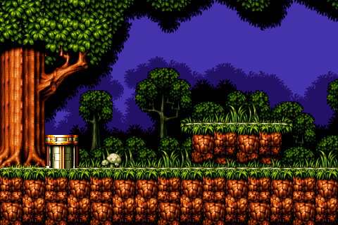
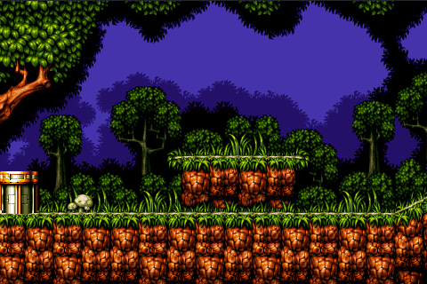
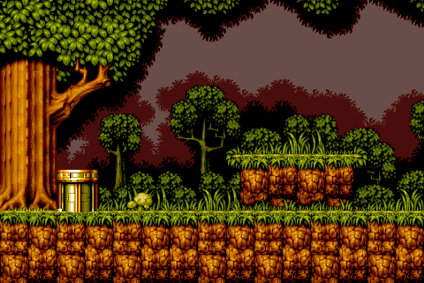

# Background layers

[TOC]

Background layers are one of the two main graphics entities in tilengine, the other are sprites. Background layers are a two dimensional arrangement of tiles, called tilemap, where each tile is a small square bitmap extracted from a bigger palette of tiles, called tileset, plus some flags that modify its appearance. Background layers can have transparent areas, where the underlying layer(s) or background color is seen.

Layers are referenced by an index, starting at 0 for the topmost, increasing up to number of layers minus 1 for the bottom-most.

## Types of layers

### Tiled layers

### Bitmap layers

### Object layers

## Common operations

### Movement & scroll

### Setting the palette

### Blending

### Priority

### Disabling

### Layer linking

## Special effects

### Column offset

### Clipping rectangle

### Scaling

### Affine transform

### Per-pixel mapping

### Mosaic

### Special effects chart

## Gameplay support: getting layer data


## Basic setup
In order to get displayed, a layer needs to have attached three items: a tilemap, a tileset and a palette. Usually a tilemap has an internal reference to its associated tileset, and a tileset has a palette embedded, we only have to explicitly set the tilemap and the other items are loaded automatically. This is accomplished with the \ref TLN_SetLayer function.

We have to load the tilemap first with \ref TLN_LoadTilemap (read more about [tilemaps](11_tilemaps.md). Then we call \ref TLN_SetLayer to attach it to the layer, passing the index layer, an optional tileset, and the tilemap to attach:
```c
TLN_Tilemap tilemap = TLN_LoadTilemap ("ruff_n_tumble.tmx");
TLN_SetupLayer (0, NULL, tilemap);
```
Layer with tilemap loaded:



We can just pass a NULL to use the internal tileset referenced by the tilemap. But we can explicitly load and attach a tileset too with \ref TLN_LoadTileset :
```c
TLN_Tilemap tilemap = TLN_LoadTilemap ("ruff_n_tumble.tmx");
TLN_Tileset tileset = TLN_LoadTileset ("ruff_n_tumble.tsx");
TLN_SetupLayer (0, tileset, tilemap);
```

## Scrolling
Scrolling is the common term for moving the display area inside a bigger map. By default, when a layer is setup for the first time, its located at position 0,0 inside the tilemap. But it can be relocated with \ref TLN_SetLayerPosition . For example, to locate the layer 0 at position 120,16 (120 pixels to the right, 16 pixels down):
```c
TLN_SetLayerPosition (0,120,16);
```
Layer moved to 120,16:


### Smooth scroll
Smooth scrolling consists in moving continuously a few pixels each time. This sample scrolls layer 0 to the right:
```c
int x = 0;
while (TLN_ProcessWindow())
{
    TLN_SetLayerPosition (0, x,16);
    TLN_DrawFrame ();
    x += 1;
}
```


### Parallax scroll
Parallax scrolling consists in scrolling at least two or more layers, where the background layer represents objects that are far away and move slowly, whereas the foreground layer has the objects that are nearer to to player and move faster.
```c
int x = 0;
while (TLN_ProcessWindow())
{
    TLN_SetLayerPosition (0, x,0);     /* move foreground layer two pixels per frame */
    TLN_SetLayerPosition (1, x/2,0);   /* move background layer one pixel per frame */
    TLN_DrawFrame ();
    x += 2;
}
```

## Setting the palette
By default, any layer uses the palette that came with the attached tileset, but it can be changed and use any other palette with \ref TLN_SetLayerPalette. We can explicitly load a palette with \ref TLN_LoadPalette :
```c
TLN_Palette palette = TLN_LoadPalette ("palette.act");
TLN_SetLayerPalette (0, palette);
```
Alternative palette:



## Blending
Blending is supported in layers, with different modes and effects. To get extended information about the modes and their effects, please refer to [Chapter 09 - Blending](09_blending.md).

To enable blending, call \ref TLN_SetLayerBlendMode passing the layer index and the blending mode. For example, to set 50%/50% blending in layer 0:
```c
TLN_SetLayerBlendMode (0, BLEND_MIX, 0);
```
The last parameter, *factor*, is kept for compatibility but isn't used.

To disable blending, call the same function with blending mode set to BLEND_NONE :
```c
TLN_SetLayerBlendMode (0, BLEND_NONE, 0);
```

## Clipping
Each layer can be assigned a clipping rectangle: a region that delimits where drawing occurs inside the window, leaving outside pixels untouched as if the layer were disabled. By default the clipping rectangle is disabled and the layer covers the entire window.

To enable the clipping rectangle, call \ref TLN_SetLayerClip passing the index of the layer, and four numbers telling the x,y of the top-left corner, and the x,y of the bottom-right corner. For example, to set clipping in layer 0 from 32,20 to 360,240:
```c
TLN_SetLayerClip (0, 32,20, 360,240);
```
Clipping rectangle 32,20 - 360,240:


To disable the clipping rectangle, call \ref TLN_DisableLayerClip passing the layer index to disable:
```c
TLN_DisableLayerClip (0);
```

## Column offset
This feature allows displacing each column of tiles in screen space by a given amount of pixels. This can be used to fake vertical parallaxing, or to do moderate tilting and deformation of terrain.

To setup the effect, it needs an array of integers as large as the number of columns that fit in one screen plus 2. For example, if you've setup a 400x240 framebuffer and are using 8x8 tiles, the number of positions is 400/8 + 2 = 52. Then call \ref TLN_SetLayerColumnOffset passing the layer index and a pointer to the array of integers:
```c
const int hres = 400;
const int tile = 8;
const int size = hres/tile + 2;
int offsets[size] = {0};
/* ... */
TLN_SetLayerColumnOffset (0, offsets);
```
Now the layer 0 column offset is linked to the *offsets* array. Setting any value(s) inside the array and drawing a frame has immediate visible effects, there's no need to call the function each time. For example, to create a slightly sloped terrain:
```c
int c;
for (c=0; c<size; c++)
    offsets[c] = c;
TLN_DrawFrame (0);
```
Column offset: each column is displaced 1 pixel incrementally:


To disable the effect, just call the function with a NULL pointer instead of a valid array:
```c
TLN_SetLayerColumnOffset (0, NULL);
```

## Scaling
Scaling is the first of the three transformation modes supported by layers, in addition to affine transform and pixel mapping. Only one mode can be active at a given moment.

Layers can be drawn upscaled or downscaled with an arbitrary factor. The scaling starts in screen space at the top-left corner, so the scrolling position isn't affected by scaling. To enable scaling, call \ref TLN_SetLayerScaling passing the layer index and two floating point values with the horizontal and vertical factor, respectively. Values greater than 1.0 upscale, and smaller than 1.0 downscale. For example to set an horizontal downscaling of 0.5 and vertical upscaling of 1.5 for layer 0:
```c
TLN_SetLayerScaling (0, 0.5f, 1.5f);
```

Layer scaling x0.5 horizontal, x1.5 vertical:


## Affine trasform
Affine transform is the second of the three transformation modes supported by layers, in addition to scaling and pixel mapping. Only one mode can be active at a given moment.

Affine transform allows to rotate, translate and scale any layer (much like SNES Mode 7 works). To enable this transformation, call \ref TLN_SetLayerTransform passing the layer index, rotation angle in degrees, two floating point values with the center of rotation in screen space, and two floating point values with horizontal and vertical scaling. For example, to enable affine transform on layer 0, 30 degrees rotation around the center of the screen, and 1.5 upscaling in both axis:
```c
TLN_SetLayerTransform (0, 30.0f, 240.0f,160.0f, 1.5f,1.5f);
```

30º degree rotation around 240,160 (screen center), x1.5 upscaling:


**TIP**: affine transform is an intensive operation. If you just want to implement scaling but not rotation, use \ref TLN_SetLayerScaling instead because it's much more lightweight.

## Per-pixel mapping
Per-pixel mapping is the last of the three transformation modes supported by layers, in addition to scaling and affine transform. Only one mode can be active at a given moment.

Per-pixel mapping is a similar operation to *column offset*, but applied to every screen pixel instead of just every column.

To setup the effect, it needs an array of \ref TLN_PixelMap items with as positions as pixels in the framebuffer. For example, for a 480x320 setup, int needs to have 480x320 = 153,600 items. Each item contains a pair of integer values with the coordinates of that pixel relative to the to left corner of the screen at 0,0. Call \ref TLN_SetLayerPixelMapping passing the layer index and a pointer to the array of \ref TLN_PixelMap items:

```c
const int hres = 480;
const int vres = 320;
const int num_pixels = hres * vres;
TLN_PixelMap pixel_map[num_pixels];
/* ... */
TLN_SetLayerPixelMapping (0, pixel_map);
```

Pixel mapping applying some trigonometric displacements to the \ref TLN_PixelMap array:


### Setting the pixel mapping table
Let's we want that pixel at 320,240 takes its value from pixel located at 200,100. First we have to calculate which pixel to modify inside the \ref TLN_PixelMap array. The formula is:
> index = y * width + x

Then we set `dx` and `dy` with the coordinates of the desired source pixel:
```c
int x = 320;          /* pixel we want to remap */
int y = 240;
int index = y * width + x;
/* ... */
pixel_map[index].dx = 200;
pixel_map[index].dy = 100;
```

## Disabling transformations
To disable any of the three previous transformation modes and return the layer to standard mode, call the \ref TLN_ResetLayerMode passing the layer index:
```c
TLN_ResetLayerMode (0);
```

## Mosaic effect
The mosaic effect pixelates the layer, making some pixels bigger and skipping others so the relative image size keeps constant. It's similar to the mosaic effect in SNES, but more flexible. Different horizontal and vertical pixel values are possible -not just square pixels-, and any size can be set, not just powers of 2. To enable the effect, call \ref TLN_SetLayerMosaic passing the layer index, the horizontal pixel size, and the vertical pixel size. For example to set mosaic on layer 0 with 8 pixel horizontal factor and 6 pixel vertical factor:
```c
TLN_SetLayerMosaic (0, 8,6);
```
Mosaic effect with 8 horizontal and 6 vertical pixel size factor:


To disable the mosaic effect, just call \ref TLN_DisableLayerMosaic passing the layer index:
```c
TLN_DisableLayerMosaic (0);
```

## Getting layer data
Sometimes it's useful to get info about the layer: width and height in pixels -which depends on its tileset and tilemap, its palette, and detailed data about a specific tile:
* Use \ref TLN_GetLayerWidth and \ref TLN_GetLayerHeight to get size in pixels
* Use \ref TLN_GetLayerPalette to get the active palette

A basic feature in any game with backgrounds and sprites is the interaction with the background. Tilengine provides the \ref TLN_TileInfo structure and the function TLN_GetLayerTile to query a tile in map coordinates. \ref TLN_TileInfo returns the row and col of the tile inside of the tilemap, the pixel offset inside the tile (distance from the top-left corner of the tile to the requested pixel), the tile index, its type (type of terrain, etc) and color index. Let's say we want to know about tile located at map coordinates 1800,300:
```c
TLN_TileInfo tile_info;                      /* declare struct to hold data */
TLN_GetLayerTile (0, 1800,300, &tile_info);  /* get layer 0 tile at 1800,300 */
```

## Disabling
To disable a layer so it is not rendered, just call \ref TLN_DisableLayer passing the layer index:
```c
TLN_DisableLayer (0);
```

## Summary
This is a quick reference of related functions in this chapter:

|Function                        | Quick description
|--------------------------------|-------------------------------------
|\ref TLN_SetLayer               |Configures a tiled background layer
|\ref TLN_SetLayerBitmap         |Configures a full-bitmap background layer
|\ref TLN_SetLayerPalette        |Sets the color palette to the layer
|\ref TLN_SetLayerPosition       |Moves the viewport inside the layer
|\ref TLN_SetLayerScaling        |Enables layer scaling
|\ref TLN_SetLayerTransform      |Sets affine transform matrix to enable rotating and scaling
|\ref TLN_SetLayerPixelMapping   |Sets the table for pixel mapping render mode
|\ref TLN_ResetLayerMode         |Disables scaling or affine transform for the layer
|\ref TLN_SetLayerBlendMode      |Sets the blending mode (transparency effect)
|\ref TLN_SetLayerColumnOffset   |Enables column offset mode for this layer
|\ref TLN_SetLayerClip           |Enables clipping rectangle
|\ref TLN_DisableLayerClip       |Disables clipping rectangle
|\ref TLN_SetLayerMosaic         |Enables mosaic effect (pixelation)
|\ref TLN_DisableLayerMosaic     |Disables mosaic effect
|\ref TLN_DisableLayer           |Disables the specified layer so it is not drawn
|\ref TLN_GetLayerPalette        |Returns the current palette of a layer
|\ref TLN_GetLayerTile           |Gets info about the tile located in tilemap space
|\ref TLN_GetLayerWidth          |Returns the layer width in pixels
|\ref TLN_GetLayerHeight         |Returns the layer height in pixels
