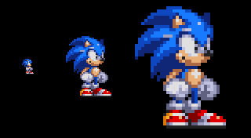

# Sprites

[TOC]

A sprite is any moving object in a videogame that is not a background: a character, enemy, bullet,player, ball, special effect...

## Basic setup
A sprite needs at least a [spriteset](12_spritesets.md), and optionally a set of [flags](\ref TLN_TileFlags) and a [palette](\ref TLN_Palette). Usually you want to pack together all the animation frames of a single character inside the same spriteset, so to change the displayed graphic it's only needed to change the image index.

We have to load the spriteset first with \ref TLN_LoadSpriteset (read more about [spritesets](12_spritesets.md)). Then we call \ref TLN_SetSpriteSet to attach it to the sprite, passing the sprite index and the reference to the spriteset:
```c
TLN_Spriteset spriteset = TLN_LoadSpriteset ("FireLeo");
TLN_SetSpriteSet (0, spriteset);
```
Now the sprite is displayed at position 0,0 by default (top-left corner) with the first graphic inside the spriteset. To change the graphic show, call \ref TLN_SetSpritePicture passing the sprite index and the graphic index inside the spriteset, starting with 0. For example to set sprite 0 with the 4th graphic inside the spriteset:
```c
TLN_SetSpritePicture (0, 3);
```
**NOTE**: each graphic inside a spriteset can have a unique name, and there is a convenient way for retrieving the graphic index based on its name: \ref TLN_FindSpritesetSprite

## Moving around
To move the sprite to a different location, call the \ref TLN_SetSpritePosition, passing the sprite index, and the x,y coordinates. These values are absolute screen coordinates. For example to move sprite 3 to 160,120:
```c
TLN_SetSpritePosition (3, 160,120);
```
## Setting attributes
There are some special modifiers that control sprite flipping and priority. Sprite flipping allows you to draw a sprite upside down and/or horizontally mirrored. For example in a platformer game you just need to draw sprites facing to the right, when you want to draw them facing left, just set the horizontal flipping flag. *Priority* determines the final composition (which elements are drawn in front of others). To set attributes, call \ref TLN_SetSpriteFlags passing the sprite index and a combination of \ref TLN_TileFlags. For example to draw sprite 0 upside down:
```c
TLN_SetSpriteFlags (0, FLAG_FLIPY)
```
Flipping modes: a) 0, b) FLAG_FLIPX, c) FLAG_FLIPY, d) FLAG_FLIPX + FLAG_FLIPY:


## Setting the palette
By default, a sprite is assigned the associated palette of its spriteset, but this can be changed calling \ref TLN_SetSpritePalette passing the sprite index and a \ref TLN_Palette reference:
```c
TLN_Palette palette = TLN_LoadPalette ("palette.act")
TLN_SetSpritePalette (0, palette);
```

## Blending
Blending is supported in sprites, with different modes and effects. To get extended information about the modes and their effects, please refer to [Chapter 09 - Blending](09_blending.md).

To enable blending, call \ref TLN_SetSpriteBlendMode passing the sprite index and the blending mode. For example, to set 50%/50% blending in sprite 0:
```c
TLN_SetSpriteBlendMode (0, BLEND_MIX, 0);
```
The last parameter, *factor*, is kept for compatibility but isn't used.

To disable blending, call the same function with blending mode set to BLEND_NONE :
```c
TLN_SetSpriteBlendMode (0, BLEND_NONE, 0);
```

## Scaling
Sprites can be drawn upscaled or downscaled with an arbitrary factor. To enable scaling, call \ref TLN_SetSpriteScaling passing the sprite index and two floating point values with the horizontal and vertical factor, respectively. Values greater than 1.0 upscale, and smaller than 1.0 downscale. For example to set an horizontal downscaling of 0.5 and vertical upscaling of 1.5 for layer 0:
```c
TLN_SetSpriteScaling (0, 0.5f, 1.5f);
```
Different sprite scaling examples:



To disable scaling, call \ref TLN_ResetSpriteScaling passing the sprite index. For example to disable scaling in sprite 0:
```c
TLN_ResetSpriteScaling (0);
```

## Collision detection
A basic action on any game is checking if two given sprites collide. For example, if our hero is hit by any enemy bullet. A quick way to determine a collision is to check if their bounding boxes overlap (a *bounding box* is the rectangular area that fully encloses a sprite). This methos is fast and easy to implement, but sometimes the bounding boxes of two sprites can overlap, but in regions where there aren't solid pixels, just transparent ones. In this case, you see that the bullet isn't going to hit your hero, but it gets actually hit without touching it. A common solution is to use bounding boxes that are *smaller* than the sprite, but this can have the opposite effect: missing collisions that actually happen.

To solve this, tilengine implements pixel-based collision detection. With this feature enabled, you know that a sprite gets involved in a collision only if there are actual non-transparent pixels in both sprites overlapping. But this methos also has a limitation: it can tell you that a given sprite is per-pixel colliding with another sprite, but you don't know with *which* sprite.

The final solution consists in combining both methods as they compliment each other: first determine coarse collision with bounding boxes, and then check per-pixel collision detection in those sprites.

Per-pixel collision detection requires more CPU cycles that regular sprites, so it's an optional feature that is disabled by default. You can enable it for each sprite calling \ref TLN_EnableSpriteCollision passing the sprite index and a boolean value with *true* to enable or *false* to disable the feature. For example, to enable collision detection for sprite 0 and disable it for sprite 3:
```c
TLN_EnableSpriteCollision (0, true);
TLN_EnableSpriteCollision (3, false);
```
To query the collision status for a given sprite, call \ref TLN_GetSpriteCollision passing the sprite index to check. It returns a boolean value indicating the collision status:
```c
bool collision = TLN_GetSpriteCollision (0);
```

## Sprite priority

## Sprite drawing order

## Sprite masking

## Disabling
To disable a sprite so it is not rendered, just call \ref TLN_DisableSprite passing the sprite index:
```c
TLN_DisableSprite (0);
```

## Summary
This is a quick reference of related functions in this chapter:

|Function                        | Quick description
|--------------------------------|-------------------------------------
|\ref TLN_ConfigSprite           |Configures a sprite, setting spriteset and flags at once
|\ref TLN_SetSpriteSet           |Assigns the spriteset and its palette to a given sprite
|\ref TLN_SetSpriteFlags         |Sets flags for a given sprite
|\ref TLN_SetSpritePosition      |Sets the sprite position inside the viewport
|\ref TLN_SetSpritePicture       |Sets the actual graphic to the sprite
|\ref TLN_SetSpritePalette       |Assigns a palette to a sprite
|\ref TLN_SetSpriteBlendMode     |Sets the blending mode (transparency effect)
|\ref TLN_SetSpriteScaling       |Sets the scaling factor of the sprite
|\ref TLN_ResetSpriteScaling     |Disables scaling for a given sprite
|\ref TLN_GetSpritePicture       |Returns the index of the assigned picture from the spriteset
|\ref TLN_GetAvailableSprite     |Returns the first available (unused) sprite
|\ref TLN_EnableSpriteCollision  |Enable sprite collision checking at pixel level
|\ref TLN_GetSpriteCollision     |Gets the collision status of a given sprite
|\ref TLN_DisableSprite          |Disables the sprite so it is not drawn
|\ref TLN_GetSpritePalette       |Returns the current palette of a sprite
