# Background layers

[TOC]

## Introduction

Background layers are used to implement the levels where gameplay takes place. They can be moved around and always fill the screen. They can be just decorations, or contain actual level structure where sprites can interact and collide (platforms, walls, environmental hazards... )

Background layers can have transparent, cut-through areas where the underlying layer(s) or background color is seen.

Layers are referenced by an index, starting at 0 for the topmost, increasing up to number of layers minus 1 for the bottom-most. The total number of layers is pre-allocated when the engine is initialized with \ref TLN_Init and cannot be changed later at runtime.

## Types of layers

Tilengine supports three types of layers:

* **Tiled layer**: uses a tilemap and a tile-based tileset
* **Object list**: uses an object list and a bitmap-based tileset
* **Single bitmap**: uses a whole bitmap

### Tiled layers

Tiled layers are composed of **tilemaps**, a rectangular, grid-like arrangement of square pieces called **tiles**. These tiles are located inside a **tileset**, a collection of related square pieces that are assembled to form a level.

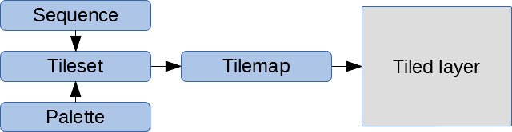<br>
*Block diagram of a tiled layer*

Tiled layers are loaded from `.tmx` files with the \ref TLN_LoadTilemap function, that gets a filename and an optional layer name, and returns a \ref TLN_Tilemap handler.

```C
TLN_Tilemap tilemap = TLN_LoadTilemap("level.tmx", "foreground");
```

If layer name is set to `NULL`, it loads the first layer it encounters:

```C
TLN_Tilemap tilemap = TLN_LoadTilemap("level.tmx", NULL);
```

Once a tilemap is loaded, it must be assigned to a layer with \ref TLN_SetLayerTilemap function. It takes the layer index and the tilemap handler:

```C
TLN_SetLayerTilemap(0, tilemap);
```

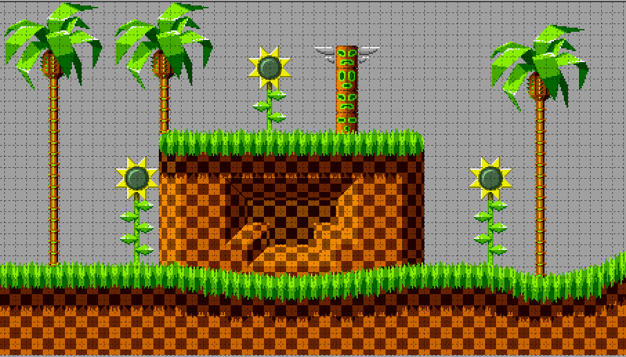<br>
*A tilemap in Tiled editor*

Explicit tileset is hardly ever user, because when a tilemap is loaded from a `.tmx` file, it already contains its associated tileset that is used by default. However it can be loaded with \ref TLN_LoadTileset from a `.tsx` file and explicitly set with \ref TLN_SetLayer:

```C
TLN_Tileset tileset = TLN_LoadTileset("level.tsx")
TLN_SetLayer(0, tileset, tilemap);
```

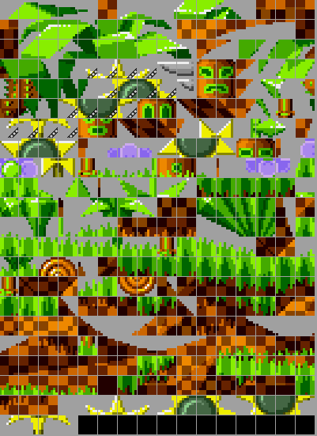<br>
*A tileset in Tiled editor*

### Bitmap layers

Bitmap layers use a single, big bitmap image that can be loaded with \ref TLN_LoadBitmap function that just takes a filename (`.bmp` and `.png` files supported):

```C
TLN_Bitmap bitmap = TLN_LoadBitmap("background.png)
```

Once a bitmap is loaded, it must be assigned to a layer with \ref TLN_SetLayerBitmap function. It takes the layer index and the bitmap:

```C
TLN_SetLayerBitmap(0, bitmap);
```

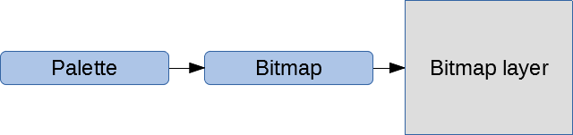<br>
*Block diagram of a bitmap layer*

### Object layers

Object layers have a list of different items freely scattered across the playfield. Each item is a bitmap inside a bitmap-based tileset.

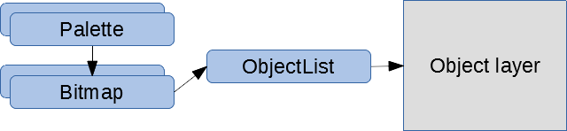<br>
*Block diagram of an object layer*

Object list are loaded from `.tmx` files too, with the \ref TLN_LoadObjectList function that takes a filename and an optional layer name, and returns a \ref TLN_ObjectList handle. Just like tiled layers, if no layer name is specified, it loads the first object layer inside the `.tmx` file:

```C
TLN_ObjectList list = TLN_LoadObjectList("level`.tmx`", NULL);
```

To enable a object list layer, it must be set with the \ref TLN_SetLayerObjects, that takes the layer index, the object list, and an optional tileset. If no tileset is specified, it uses the default tileset of the object list:

```C
TLN_SetLayerObject(0, list, NULL);
```

However an explicit bitmap-based tileset can be loaded and assigned:

```C
TLN_Tileset tileset = TLN_LoadTileset("objects.tsx")
TLN_SetLayerObject(0, list, objects);
```

## Common operations

Layers have a common set of operations that are available to all three types of layers

### Movement & scroll

Layers can be much bigger than the display area. To set the what zone is being displayed, use \ref TLN_SetLayerPosition passing the layer index, and the horizontal (x) and vertical (y) displacement from the origin located in the top-left corner.

Sets layer 0 starting at x=320 and y=160:
```C
TLN_SetLayerPosition(0, 320,160);
```

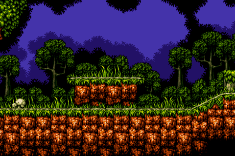

### Setting the palette

When a layer is configured, it automatically gets the palette of the attached asset -tileset or bitmap-. However is possible to change the palette to another one with \ref TLN_SetLayerPalette, passing the layer index and a handle to a \ref TLN_Palette object.

```C
TLN_Palette palette = TLN_LoadPalette("palette.act");
TLN_SetLayerPalette(0, palette);
```

It's also possible to retrieve the current palette of a layer with \ref TLN_GetLayerPalette, passing the layer index, and returning a handle to a \ref TLN_Palette object:

```C
TLN_Palette palette = TLN_GetLayerPalette(0);
```

### Blending

Blending allows to combine the color of a layer with the underlying color already present. There are several predefined blending modes, read chapter.

To enable blending on a layer use \ref TLN_SetLayerBlendMode passing the layer index and one of available \ref TLN_Blend modes:

```C
TLN_SetLayerBlendMode(0, BLEND_MIX50);
```

To disable blending, use \ref BLEND_NONE mode:

```C
TLN_SetLayerBlendMode(0, BLEND_NONE);
```

### Priority

By default, background layers are drawn behind the sprites -that's why they're background layers-. However a given layer can also be drawn in front of sprites, giving it *priority* over sprites. Use \ref TLN_SetLayerPriority passing the layer index, and a boolean with `true`to enable or `false` to or disable priority:

```C
/* enable priority on layer 0 */
TLN_SetLayerPriority(0, true);

/* disable priority on layer 0 */
TLN_SetLayerPriority(0, false);
```

### Clipping rectangle

Each layer can be assigned a clipping rectangle: a region that delimits where drawing occurs inside the window, leaving outside pixels unaffected. By default the clipping rectangle is disabled and the layer covers the entire window.

To enable the clipping rectangle, call \ref TLN_SetLayerClip passing the index of the layer, and four numbers telling the x,y of the top-left corner, and the x,y of the bottom-right corner. For example, to set clipping in layer 0 from 32,20 to 360,240:
```c
TLN_SetLayerClip (0, 32,20, 360,240);
```
Clipping rectangle 32,20 - 360,240:

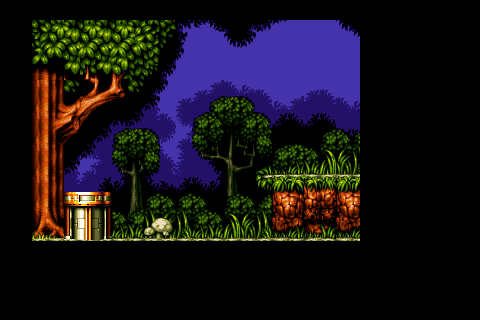

To disable the clipping rectangle, call \ref TLN_DisableLayerClip passing the layer index to disable:
```c
TLN_DisableLayerClip (0);
```

### Layer linking

Layers can have their positions linked, so when a layer is moved with \ref TLN_SetLayerPosition, any layer linked to it will move to the same position. This is useful with object layers that are overlaid on top if tiled layers, residing in the same plane. To link a layer, use \ref TLN_SetLayerParent passing the layer index to link, and the layer index that will be linked to.

```C
TLN_SetLayerParent(0, 1);
TLN_SetLayerPosition(1, 320,160);
/* layer 0 is also moved to 320,160 */
```

### Disabling

Layers can be disabled when they're not needed anymore with \ref TLN_DisableLayer, passing the layer index. A disabled layer cannot be re-enabled, it must be configured again.

```C
TLN_DisableLayer(0);
```

## Special effects

### Column offset

This feature allows displacing vertically each column of tiles in screen space by a given amount of pixels. This can be used to fake vertical parallaxing, or to do moderate tilting and deformation of terrain.

To setup the effect, it needs an array of integers as large as the number of columns that fit in one screen plus 2. For example, with a 400x240 framebuffer and are 16x16 tiles, the number of positions is 400/16 + 2 = 27. Call \ref TLN_SetLayerColumnOffset passing the layer index and a pointer to the array of integers:
```c
const int hres = 400;
const int tile_width = 16;
const int size = hres/tile_width + 2;
int offsets[size] = { 0 };
/* ... */
TLN_SetLayerColumnOffset(0, offsets);
```
Now the layer 0 column offset is linked to the *offsets* array. Setting any value(s) inside the array and drawing a frame has immediate visible effects, there's no need to call the function each time. For example, to create a slightly sloped terrain:
```c
int c;
for (c = 0; c < size; c += 1)
    offsets[c] = c;
TLN_DrawFrame(0);
```
Column offset: each column is displaced 1 pixel incrementally:

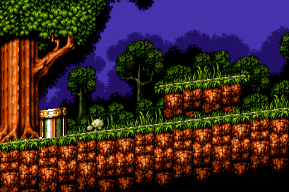

To disable the effect, call the function with a `NULL` pointer instead of a valid array:
```c
TLN_SetLayerColumnOffset (0, NULL);
```

This effect is only available on tiled layers.

### Scaling

Layers can be drawn upscaled or downscaled with an arbitrary factor. The scaling starts in screen space at the top-left corner, so the scrolling position isn't affected by scaling. To enable scaling, call \ref TLN_SetLayerScaling passing the layer index and two floating point values with the horizontal and vertical factor, respectively. Values greater than 1.0 upscale, and smaller than 1.0 downscale. For example to set an horizontal downscaling of 0.5 and vertical upscaling of 1.5 for layer 0:
```c
TLN_SetLayerScaling (0, 0.5f, 1.5f);
```

Layer scaling x0.5 horizontal, x1.5 vertical:

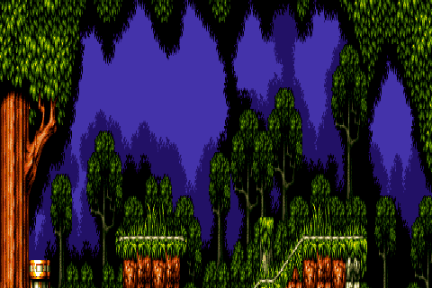

To disable scaling, call \ref TLN_ResetLayerMode passing the layer index:
```c
TLN_ResetLayerMode (0);
```

This effect is available for tiled and bitmap layers.

### Affine transform

Affine transform allows to rotate, translate and scale any layer (much like SNES Mode 7). To enable this transformation, call \ref TLN_SetLayerTransform passing the layer index, rotation angle in degrees, two floating point values with the center of rotation in screen space, and two floating point values with horizontal and vertical scaling. For example, to enable affine transform on layer 0, 30 degrees rotation around the center of the screen, and 1.5 upscaling in both axis:
```c
TLN_SetLayerTransform (0, 30.0f, 240.0f,160.0f, 1.5f,1.5f);
```

30º degree rotation around 240,160 (screen center), x1.5 upscaling:

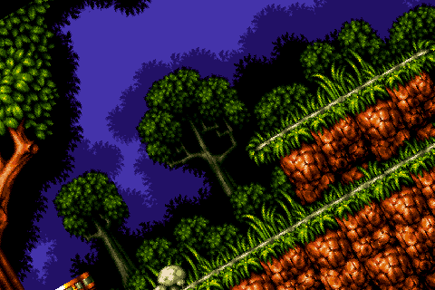

**TIP**: affine transform is an intensive operation. If you just want to implement scaling but not rotation, use \ref TLN_SetLayerScaling instead because it's much more lightweight.

To disable affine transform, call \ref TLN_ResetLayerMode passing the layer index:
```c
TLN_ResetLayerMode (0);
```

This effect is available for tiled and bitmap layers.

### Per-pixel mapping

Per-pixel mapping is a similar operation to *column offset*, but applied to every screen pixel instead of just every column.

To setup the effect, it needs an array of \ref TLN_PixelMap items with as many positions as pixels in the framebuffer. For example, for a 480x320 setup, it needs to have 480x320 = 153,600 items. Each item contains a pair of integer values with the coordinates of that pixel relative to the to left corner of the screen at 0,0. Call \ref TLN_SetLayerPixelMapping passing the layer index and a pointer to the array of \ref TLN_PixelMap items:

```c
const int hres = 480;
const int vres = 320;
const int num_pixels = hres * vres;
TLN_PixelMap pixel_map[num_pixels];
/* ... */
TLN_SetLayerPixelMapping (0, pixel_map);
```

Pixel mapping applying some trigonometric displacements to the \ref TLN_PixelMap array:

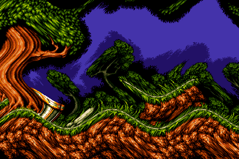

Let's we want that pixel at 320,240 takes its value from pixel located at 200,100. First we have to calculate which pixel to modify inside the \ref TLN_PixelMap array. The formula is:
> index = y * width + x

Then we set `dx` and `dy` with the coordinates of the desired source pixel:
```c
int x = 320;          /* pixel we want to remap */
int y = 240;
int index = y * width + x;
/* ... */
pixel_map[index].dx = 200;
pixel_map[index].dy = 100;
```

This effect is available for tiled and bitmap layers.

### Mosaic

The mosaic effect pixelates the layer, making some pixels bigger and skipping others so the relative image size keeps constant. It's similar to the mosaic effect in SNES, but more flexible. Different horizontal and vertical pixel values are possible -not just square pixels-, and any size can be set, not just powers of 2. To enable the effect, call \ref TLN_SetLayerMosaic passing the layer index, the horizontal pixel size, and the vertical pixel size. For example to set mosaic on layer 0 with 8 pixel horizontal factor and 6 pixel vertical factor:
```c
TLN_SetLayerMosaic (0, 8,6);
```
Mosaic effect with 8 horizontal and 6 vertical pixel size factor:

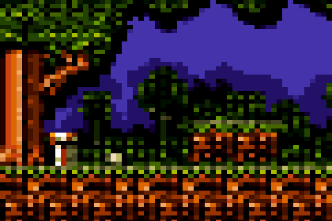

To disable the mosaic effect, just call \ref TLN_DisableLayerMosaic passing the layer index:
```c
TLN_DisableLayerMosaic (0);
```

This effect is available for tiled and bitmap layers.

### Special effects chart

Not all special effects are available for any layer. This chart shows which effects are available on which layers:

Effect       | Tiled | Bitmap | Object
-------------|-------|--------|--------------
Column offset| yes   | -      | -
Scaling      | yes   | yes    | -
Affine       | yes   | yes    | -
Per-pixel map| yes   | yes    | -
Mosaic       | yes   | yes    | -

## Gameplay support: getting layer data

Gameplay using layers for character interaction will require gathering information about it:

* Size in pixels
* Details about any tile

Use \ref TLN_GetLayerWidth and \ref TLN_GetLayerHeight to get size in pixels:

```C
int width = TLN_GetLayerWidth(0);
int height = TLN_GetLayerHeight(0);
```

To get details about a specific tile, call \ref TLN_GetLayerTile passing the layer index, the x,y pixel in layer space, and a pointer to a \ref TLN_TileInfo struct that will hold the returned data.

```c
TLN_TileInfo tile_info;                      /* declare struct to hold returned data */
TLN_GetLayerTile (0, 1800,300, &tile_info);  /* get layer 0 tile at 1800,300 */
```

**NOTE**: This function is only available for tiled layers

## Summary

This is a quick reference of related functions in this chapter:

|Function                        | Quick description
|--------------------------------|-------------------------------------
|\ref TLN_SetLayer               |Configures a tiled background layer
|\ref TLN_SetLayerBitmap         |Configures a full-bitmap background layer
|\ref TLN_SetLayerObjects        |Configures an object list background layer
|\ref TLN_SetLayerPalette        |Sets the color palette to the layer
|\ref TLN_SetLayerPosition       |Moves the viewport inside the layer
|\ref TLN_SetLayerClip           |Enables clipping rectangle
|\ref TLN_DisableLayerClip       |Disables clipping rectangle
|\ref TLN_SetLayerBlendMode      |Sets the blending mode (transparency effect)
|\ref TLN_SetLayerParent         |Enables layer position linking
|\ref TLN_SetLayerPriority       |Sets layer to be drawn on top of sprites
|\ref TLN_SetLayerScaling        |Enables layer scaling
|\ref TLN_SetLayerTransform      |Sets affine transform matrix to enable rotating and scaling
|\ref TLN_SetLayerPixelMapping   |Sets the table for pixel mapping render mode
|\ref TLN_ResetLayerMode         |Disables scaling or affine transform for the layer
|\ref TLN_SetLayerColumnOffset   |Enables column offset mode for this layer
|\ref TLN_SetLayerMosaic         |Enables mosaic effect
|\ref TLN_DisableLayerMosaic     |Disables mosaic effect
|\ref TLN_DisableLayer           |Disables the specified layer so it is not drawn
|\ref TLN_GetLayerPalette        |Returns the current palette of a layer
|\ref TLN_GetLayerWidth          |Returns the layer width in pixels
|\ref TLN_GetLayerHeight         |Returns the layer height in pixels
|\ref TLN_GetLayerTile           |Gets info about the tile located in tilemap space
