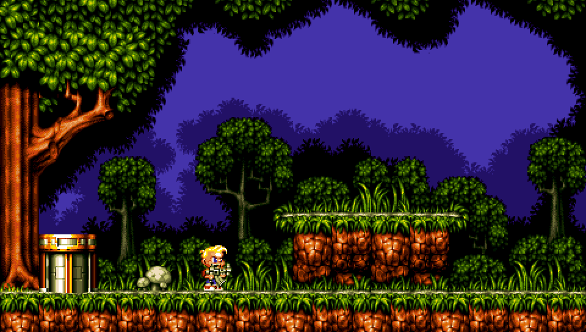

# Getting started

[TOC]

This guide takes you through writing a simple application using Tilengine. The application will initialize the engine, create a window, load a background layer and a sprite, and exit when the user closes the window. This guide will introduce a few of the most commonly used functions, but there are many more.

## Step by step

### Including the Tilengine header

In the source files of your application where you use Tilengine, you need to include the header file:

```C
#include "Tilengine.h"
```

### Initializing the engine

First step is initialize the engine with \ref TLN_Init. This takes the following parameters, that will remain constant and cannot be changed once the engine is initialized:

* Width and height of the framebuffer (virtual screen)
* Maximum number of [background layers](layers.md)
* Maximum number of [sprites](sprites.md)
* Maximum number of color-cycle [palette animations](animations.md)

```C
TLN_Init(480, 272, 4, 64, 0);
```

This creates a framebuffer of 480x272 pixels, 4 background layers, 64 sprites and no palette animations.

### Creating a window

By default Tilengine doesn't create a window when it's initialized, because it is designed to act as a slave renderer for any framework or environment. However it also provides its own window environment.

To create a window, call \ref TLN_CreateWindow **after** having called \ref TLN_Init:

```C
TLN_CreateWindow(NULL, 0);
```

This creates a default window. There are some key bindings:

* Press <kbd>Esc</kbd> to close the window
* Press <kbd>Alt</kbd> + <kbd>Enter</kbd> to toggle full-screen/windowed
* Press <kbd>Backspace</kbd> to toggle on/off built-in CRT effect (default on)

### Loading a tilemap

[Tilemaps](tilemaps.md) with the layout of backgrounds are stored inside `.tmx` files. Each `.tmx` file can contain many tilemap and object layers. To load one, call \ref TLN_LoadTilemap with the filename and the name of the layer to load, and returns a \ref TLN_Tilemap handler:

```C
TLN_Tilemap background = TLN_LoadTilemap ("ruff_n_tumble.tmx", NULL);
```

### Setting the layer

Once the tilemap is loaded, it must be assigned to one of the available background layers with \ref TLN_SetLayerTilemap, passing the layer index and the loaded tilemap:

```C
TLN_SetLayerTilemap(0, background);
```

### Scrolling the background layer

By default the tilemap is aligned to the top-left corner of the screen (position 0,0). To move it to another position, use \ref TLN_SetLayerPosition passing the layer index and the [x, y] position inside the tilemap:

```C
TLN_SetLayerPosition(0, 32, 0);
```

This advances the viewport of layer 0 32 pixels to the right.

### Loading a spriteset

[Spritesets](spritesets.md) containing the animation frames for a sprite are contained inside `.png` files with layout information in associated `.txt`, `.csv`, or `.json` text files. They're loaded with \ref TLN_LoadSpriteset passing the .png file, and return a \ref TLN_Spriteset handler:

```C
TLN_Spriteset character = TLN_LoadSpriteset("ruff1.png");
```

### Setting the sprite

Once the spriteset is loaded, it must be assigned to one of the available spritest with \ref TLN_SetSpriteSet, passing the sprite index and the loaded spriteset:

```C
TLN_SetSpriteSet(0, character);
```

### Moving the sprite around

By default, the sprite is initialized at position 0,0, (top left corner). To move it to another location, use \ref TLN_SetSpritePosition passing the sprite index, and the, x,y screen coordinates:

```C
TLN_SetSpritePosition(0, 160, 192);
```

### Setting the sprite image

A spriteset contains many frames of animation. By default a sprite is assigned the first image of the spriteset. Images in a spriteset are referenced with their index, starting from 0. Indexes can be obtained from sprite name with \ref TLN_FindSpritesetSprite and assigned with \ref TLN_SetSpritePicture passing sprite index and frame index:

```C
int frame = TLN_FindSpritesetSprite(spriteset, "standing1");
TLN_SetSpritePicture(0, index);
```

A good practice is to cache the indexes of required frames so they don't need to be searched every time.

### Running the window loop

On each frame the window must be updated with \ref TLN_ProcessWindow, which returns `true` until the user requests closing the window, and the frame must be rendered with \ref TLN_DrawFrame. Parameter "frame" is deprecated and can be left as 0:

```C
while (TLN_ProcessWindow()) {
    TLN_DrawFrame (0);
}
```

The window will continue active until closed or <kbd>Esc</kbd> key is pressed.

## Putting it together

Now it's possible to create a simple program that initializes the engine, creates a window, and sets up a background layer and a sprite loaded from asset files:

### Source code

```C
#include "Tilengine.h"

void main(void) {
    TLN_Tilemap background;
    TLN_Spriteset character;

    /* init engine and window */
    TLN_Init(480, 272, 4, 64, 0);
    TLN_CreateWindow (NULL, 0);

    /* setup background layer */
    background = TLN_LoadTilemap ("ruff_n_tumble.tmx", NULL);
    TLN_SetLayerTilemap (0, background);
    TLN_SetLayerPosition(0, 32, 0);

    /* setup sprite */
    character = TLN_LoadSpriteset("ruff1.png");
    TLN_SetSpriteSet(0, character);
    TLN_SetSpritePosition(0, 160, 192);

    /* loop until close */
    while (TLN_ProcessWindow())
        TLN_DrawFrame(0);

    /* release resources */
    TLN_DeleteSpriteset(character);
    TLN_DeleteTilemap(background);
    TLN_DeleteWindow();
    TLN_Deinit();
}
```

### Building

To build for Linux, just link with `libTilengine.so` library:

```
gcc test.c -lTilengine -o test
```

Building for Windows requires linking to `Tilengine.lib`:

```
gcc test.c Tilengine.lib -o test.exe
```

### Final result


