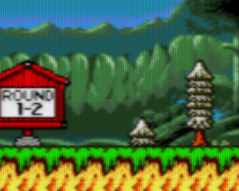

# Windowing

[TOC]

The built-in window in tilengine provides a basic, easy to setup environment for quick test and evaluation. It's a very simple environment to ease prototyping but is not intended to be used in production environment.

## Features
* Runs windowed or full-screen
* User input with keyboard or gamepad
* CRT post-processing emulation filter
* Single thread or multi-threaded

## Single threaded window
The single threaded window runs inside the main thread and must be handled inside the game loop for each frame. The window is created with \ref TLN_CreateWindow. With default parameters it creates a window with an integer scaling as large as possible for the desktop resolution, and with CRT emulation effect enabled:
```c
TLN_CreateWindow (NULL, 0);
```

Supported creation flags are as follows:

|Flag value    |Effect
|--------------|----------------------------
|CWF_FULLSCREEN|create a full-screen window
|CWF_VSYNC     |sync frame updates with vertical retrace
|CWF_Sn        |force integer upscale factor (n is 1-5)
|CWF_NEAREST   |start with CRT/RF effect disabled

The following key combinations are used to control the window:

|Key                   |Effect
|----------------------|-------------------------------------
|<kbd>Alt + Enter</kbd>|Toggle windowed/full-screen mode
|<kbd>Backspace</kbd>  |Toggle CRT/RF effect or on off
|<kbd>Escape</kbd>     |Close the window

Once the window is created, it must be processed calling \ref TLN_ProcessWindow for each frame. This function returns true while the window is alive, or false when the user has requested to terminate it. Draw the frames with \ref TLN_DrawFrame. This function takes an optional integer value, that represents a frame counter used by the animation engine.

This basic sample show how to initialize the engine, create the window and do the window loop until the user requests to exit:

```c
TLN_Init (400,240, 2,8,0);   /* init the engine */
TLN_CreateWindow (NULL, 0);  /* create the window */
while (TLN_ProcessWindow())  /* the window loop */
    TLN_DrawFrame (0);       /* draw next frame */

TLN_Deinit ();               /* release resources */
```

## Multi-threaded window
The multi-threaded window spans its own thread and runs in parallel, without a window loop. It's mainly used for interactive use within an editor as in python. The multi-threaded window is created with \ref TLN_CreateWindowThread and doesn't require continuous calls to \ref TLN_ProcessWindow or \ref TLN_DrawFrame. Instead you query its active state with \ref TLN_IsWindowActive, and optionally you can sync to it with \ref TLN_WaitRedraw.

This is the same sample with the multi-threaded window:
```c
TLN_Init (400,240, 2,8,0);         /* init the engine */
TLN_CreateWindowThread (NULL, 0);  /* create the window */
while (TLN_IsWindowActive())       /* check window state */
    TLN_WaitRedraw ();             /* optionally sync to window drawing for fps control */

TLN_Deinit ();                     /* release resources */
```

## User input
User input in tilengine simulates a basic arcade setup, with 4-way directions, 6 action buttons and a Start button, and up to 4 simultaneous players. It can be controlled with keyboard or joystick/gamepad. By default, only the first 4 buttons of player 1 are assigned as follows:

|Player 1 Input   |Assigned to...
|-----------------|--------------------------
|4-way direction  |keyboard cursors or gamepad D-Pad
|Buttons 1-4      |<kbd>Z,X,C,V</kbd> or gamepad buttons 1-4.
|Start button     |<kbd>Enter</kbd> or gamepad button 5.

To check the state of an input, call \ref TLN_GetInput with one of the possible \ref TLN_Input values:

|Input name    |Meaning
|--------------|-----------------------------
|INPUT_UP      |up direction
|INPUT_DOWN    |down direction
|INPUT_LEFT    |left direction
|INPUT_RIGHT   |right direction
|INPUT_BUTTONn |action button (n is 1-6)
|INPUT_START   |Start button

For example, to check if player 1 left arrow is pushed do this:
```c
if (TLN_GetInput(INPUT_LEFT))
{
    /* do your treatment */
}
```

### Redefining inputs
To define new key and joystick bindings to inputs, use the functions
\ref TLN_AssignInputJoystick, \ref TLN_DefineInputKey and \ref TLN_DefineInputButton. The code identifiers for key bindings are the same used inside the SDL2 library, so you'll need to include `SDL.h` header. For example, to assign the <kbd>Space</kbd> key to  player 2 start button:
```c
#include <SDL2/SDL.h>
...
TLN_DefineInputKey (PLAYER2, INPUT_START, SDLK_SPACE);
```

### Local multiplayer
By default only player 1 input is enabled. To enable or disable input processing for a given player, call \ref TLN_EnableInput with the desired player `PLAYER1` to `PLAYER4`. For example to enable player 2 input:
```c
TLN_EnableInput (PLAYER2);
```

To request input for a specific player, combine the name of the input with the modifier `INPUT_Pn`, where `n` is the player number (1 to 4). For example, to check if player 2 has pushed start:
```c
if (TLN_GetInput(INPUT_P2 + INPUT_START))
{
    /* do your treatment */
}
```

### Enhanced input with SDL2
If the built-in input layout of tilengine is not enough, because your game needs mouse input, analog sticks, more keys, etc. Tilengine can catch the events delivered by the underlying SDL2 library and pass them to your own input handling. This is done by a user callback, that can be registered with \ref TLN_SetSDLCallback function. The user callback must have the format `void sdl_callback(SDL_Event*);`. For example, to check mouse click:
```c
#include <SDL2/SDL.h>
...
/* user callback: check mouse click event and put sprite 0 at clicked coordinates */
void my_mouse_callback(SDL_Event* sdl_event)
{
    if (sdl_event->type == SDL_MOUSEBUTTONDOWN)
    {
        SDL_MouseButtonEvent* mouse = (SDL_MouseButtonEvent*)sdl_event;
        TLN_SetSpritePosition (0, mosue->x, mouse->y);
    }
}

/* register the callback */
TLN_SetSDLCallback (my_mouse_callback);
```

For extended info about SDL input handling, please check this link: https://wiki.libsdl.org/SDL_Event

## Time & delay
Tilengine window provides some basic timing functions. \ref TLN_GetTicks returns the number of milliseconds elapsed since system started, and \ref TLN_Delay pauses execution for the given amount of milliseconds.

## The CRT effect
All low resolution, pixel art games were played on CRT displays that provided its unique texture and feel. Trying to watch this type of games in crystal-clear, big square pixels, is just wrong. The CRT effect simulates more or less faithfully the characteristics of a CRT display: visible RGB strips, horizontal blur, bright pixel bloom...

Plain output without CRT:<br>


The same output but with default CRT enabled:<br>


By default the CRT effect is enabled when the window is created, but it can be disabled with the \ref TLN_DisableCRTEffect function. It can be toggled pressing the <kbd>Escape</kbd> key, too.

The effect is highly configurable with the \ref TLN_EnableCRTEffect function. It takes many parameters to customize its appearance and strength. The default parameters are:
```c
TLN_EnableCRTEffect (TLN_OVERLAY_APERTURE, 128, 192, 0,64, 64,128, false, 255);
```

## Summary
This is a quick reference of related functions in this chapter:

|Function                       | Quick description
|-------------------------------|-------------------------------------
|\ref TLN_CreateWindow          |Creates a SDL2 window for rendering
|\ref TLN_CreateWindowThread    |Creates a multi-threaded SDL2 window for rendering
|\ref TLN_SetWindowTitle        |Sets the window title
|\ref TLN_ProcessWindow         |Process user input events
|\ref TLN_IsWindowActive        |Checks if the window is still active
|\ref TLN_GetInput              |Checks the state of a given input
|\ref TLN_EnableInput           |Enables input for given player
|\ref TLN_AssignInputJoystick   |Binds a joystick to a given player
|\ref TLN_DefineInputKey        |Binds a key to a given player input
|\ref TLN_DefineInputButton     |Binds a joystick button to a given player input
|\ref TLN_DrawFrame             |Renders a new frame to the window
|\ref TLN_WaitRedraw            |Syncs to redraw in multi-threaded window
|\ref TLN_DeleteWindow          |Destroys the window
|\ref TLN_EnableCRTEffect       |Configures the CRT/RF video effect
|\ref TLN_DisableCRTEffect      |Disables the CRT/RF video effect
|\ref TLN_SetSDLCallback        |Sets function to call when SDL input events happen
|\ref TLN_Delay                 |Waits for the specified amount of milliseconds
|\ref TLN_GetTicks              |Returns the number of milliseconds since window creation
