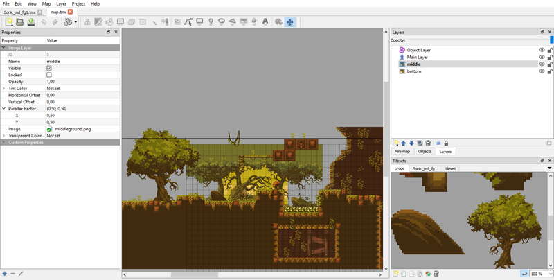
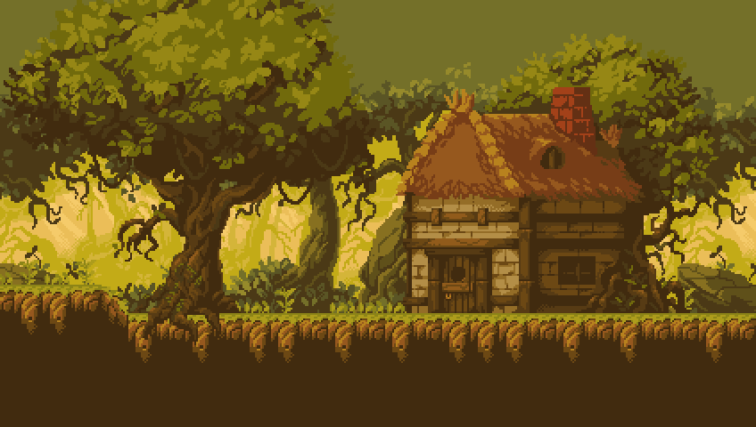
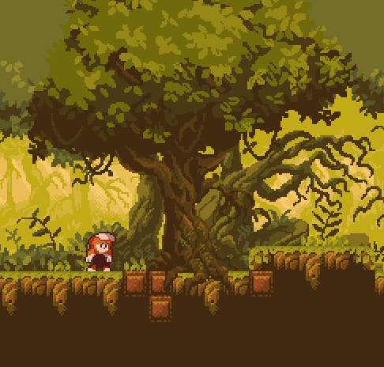

# World usage

Release 2.9.0 introduces the world mode. In previous versions, each layer and sprite coordinates work in screen space. In "classic" mode, each layer must be loaded and set up independently. Scrolling requires manually repositioning all layers and sprites on each update.

In world mode, selected layers and sprites are tied to global "world" position, so when the world position is updated, all layers and sprites are updated accordingly.

## Load

World mode starts by loading a full tmx file with \ref TLN_LoadWorld, specifying the name of the tmx file, and the index of the starting layer that will hold all the layers contained in the tmx file. This index is useful to reserve top-most layers that won't be affected by world position, mainly the HUD

These are the Tiled features loaded:

* background color
* all types of layers: tile, bitmap and object
* all related resources (tilemaps, tilesets and bitmaps)
* layer parallax factor
* layer offset
* layer opacity rounded to 0%, 25%, 50%, 75% or 100%
* layer visible state



Load and setup the map file `assets/forest/map.tmx` that contains a background color, four parallax layers (an objects one, a tiled one, and two bitmapped), leaving layer 0 for the HUD:

```C
TLN_SetLoadPath("assets/forest");
TLN_LoadWorld("map.tmx", 1);
```



Layers 1 to 4 are assigned with the layers inside the tmx file:

* layer 0 is not assigned to the world (reserved for HUD)
* layer 1 has "Object Layer" with objects/props
* layer 2 has "Main Layer" with foreground tiled layer
* layer 3 has "middle" with middle-ground bitmap
* layer 4 has "bottom" with background bitmap

## Setting sprite position

Positioning sprites is done with \ref TLN_SetSpriteWorldPosition, that takes the sprite index, and the horizontal and vertical coordinates. This function behaves like the classic \ref TLN_SetSpritePosition, but coordinates are in world space instead of screen space. When world position is updated, location of sprite in screen will be updated accordingly.

Set sprite 3 at x=2400, y=50 in world space:

```C
TLN_SetSpriteWorldPosition(3, 2400, 50);
```

**NOTE**: once a sprite is set in world space, to revert it to classic screen space it must be disabled with \ref TLN_DisableSprite and re-assigned with \ref TLN_ConfigSprite again.

## Scrolling

Moving the global world position is done with \ref TLN_SetWorldPosition, that takes the x and y coordinates in world space. For example to move to x=2200 and y=0:

```C
TLN_SetWorldPosition(2200, 0);
```

When the world position is updated:

* layer positions are updated according to their parallax and offset factors
* sprite screen positions are updated according to their world position



## Layer parallax factor

Parallax factor for each layer is obtained from the .tmx file. However it may be useful to set it at runtime to use in raster effects, modifying it a select scanlines to implement multiple strips or linescroll. Use \ref TLN_SetLayerParallaxFactor setting the x and y factor in floating point format. 

* 1.0 will make the layer scroll at the same speed than the world (layer position = world position)
* &lt; 1.0 values will make the layer scroll slower than the world (layer position < world position)
* &gt; 1.0 values will make the layer scroll faster than the world (layer position > world position)

For example to set layer 2 scroll factor to x=0.5, y=0:

```C
TLN_SetLayerParallaxFactor(2, 0.5f, 0);
```

This will make layer 2 to scroll at half speed than world position horizontally, and keep fixed vertically

## Release world resources

When you're done working with the loaded level, release all its resources with \ref TLN_ReleaseWorld. It will:

* disable all used layers
* release all loaded assets

## Full example

`samples/Forest` example showcases world mode for both layers and sprites.

Graphic assets produced by **Ansimuz**:<br>
https://ansimuz.itch.io/sunnyland-forest

## Summary

This is a quick reference of related functions in this chapter:

|Function                        | Quick description
|--------------------------------|-------------------------------------
|\ref TLN_LoadWorld              | Loads full tmx file
|\ref TLN_SetSpriteWorldPosition | Sets sprite position in world space
|\ref TLN_SetWorldPosition       | Sets current world position
|\ref TLN_SetLayerParallaxFactor | Overrides default layer parallax factor
|\ref TLN_ReleaseWorld           | Releases world resources
